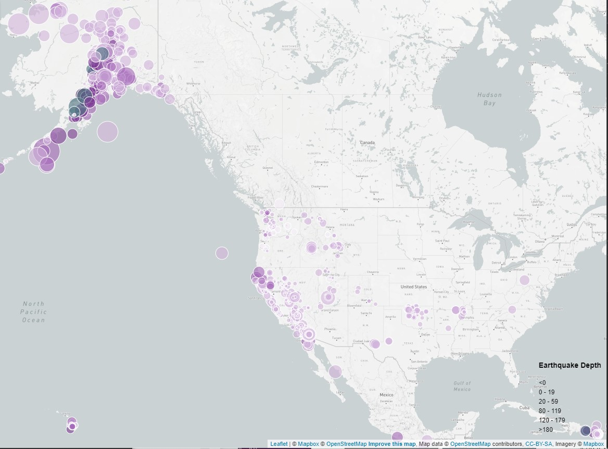

# Leaflet Example - Visualizing USGS Earthquake Data On A Map

In this exercise I will show you how to create a Leaflet map that will visualize earthquake data from the USGS. It will look like the following screen shot.

